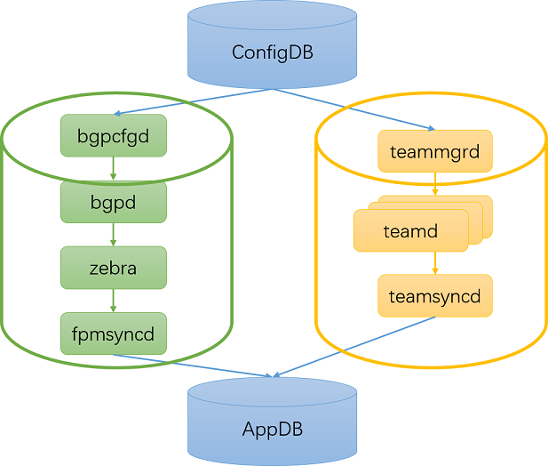
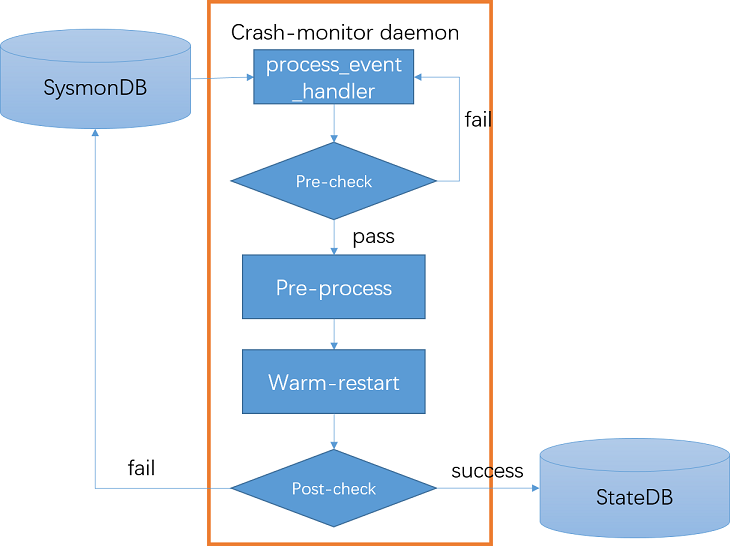

# SONiC Warm Recovery
Table of Contents
=================
* [Overview](#overview)
* [Use cases](#use-cases)
  * [BGP docker warm recovery](#bgp-docker-warm-recovery)
  * [TEAMD docker warm recovery](#teamd-docker-warm-recovery)
  * [SWSS docker warm recovery](#swss-docker-warm-recovery)
  * [SYNCD docker warm recovery](#syncd-docker-warm-recovery)
* [Warm Recovery Steps](#warm-recovery-steps)
  * [process event handler](#process-event-handler)
  * [pre-check](#pre-check)
  * [pre-processing](#pre-processing)
  * [warm-restart docker](#warm-restart-docker)
  * [post-check](#post-check)
* [Requirements](#requirements)

# Overview
The goal of warm recovery is to restart SONiC process/dockers from unexpected failure without/minimizing impacting the data plane traffic. It is desired for all network applications and orchagent to be able to handle unplanned restart due to unexpected process crash.

# Use cases

## BGP docker warm recovery
Bgp docker will be restarted in case bgpcfgd/bgpd/zebra/fpmsyncd crashes.
Upon app crash, the bgp docker will restart gracefully and gets synchronized with the latest routing state via talking with peers, fpmsyncd uses the input from BGP to program appDB and it also deals with any stale/new routes besides those routes without change. RouteOrch responds to the operation requests from fpmsyncd and propagates any change down to syncd.

## Teamd docker warm recovery
teamd docker will be restarted in case teammgrd/teamsyncd/teamd crashes.

## SWSS docker warm recovery
SWSS docker will be restarted in case XXXcfgd/YYYorch/ZZZsyncd crashes

## SYNCD docker warm recovery
It is not a requirement on syncd and ASIC/LibSAI due to dependency on ASIC processing.

# Warm Recovery Steps

## process event handler
* listens to process state change event from sysmonDB
or
* periodically check the status of each process and handle failure
## pre-check
* check if process is configured with auto-recovery
* check if process is still alive
* check process restart limit
## pre-processing
* delay some time if necessary
* config warm_restart enable
* stop other processes inside docker gracefully
## warm-restart docker
* warm restart the docker
## post-check
* wait for container startup and reconcile to be succesful
* update warm-recovery status in stateDB

# Requirements
## BGP docker
* ensure routes in appDB is in sync with ASIC
* enable graceful restart config by default:
  * bgp graceful restart
  * bgp_graceful_restart_preserve_fw_state
## TEAMD docker
* monitor individual team daemon for each port channel
* clean up teamsyncd reconcile logic
## SWSS docker
* atomic operations
* clean up services dependencies
